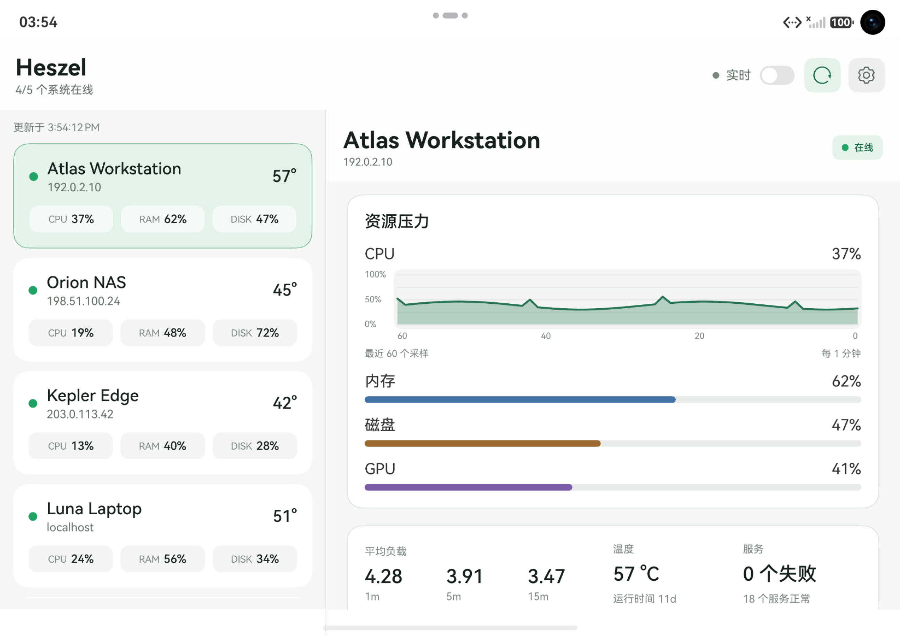
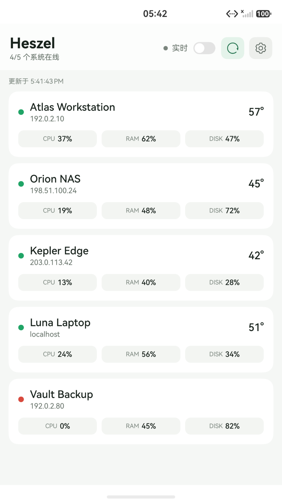
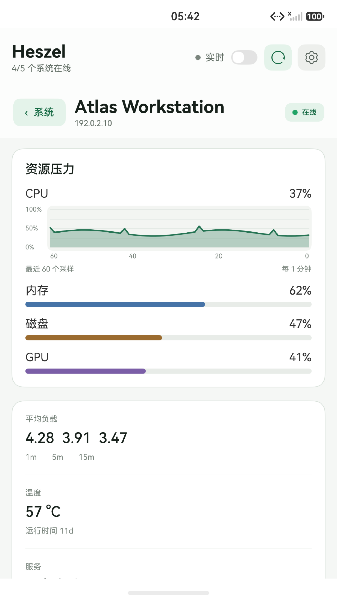
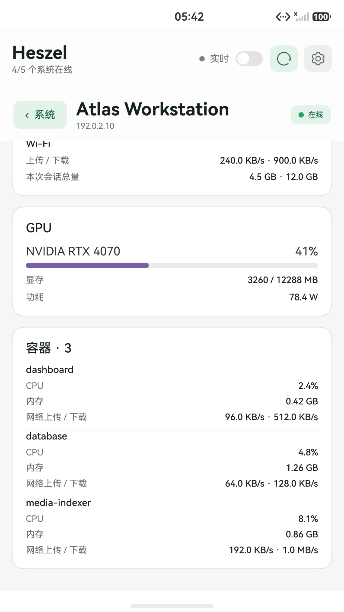
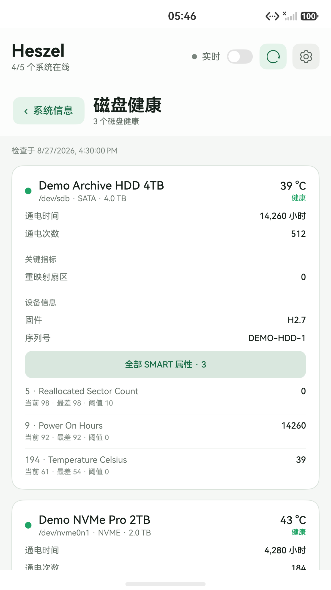
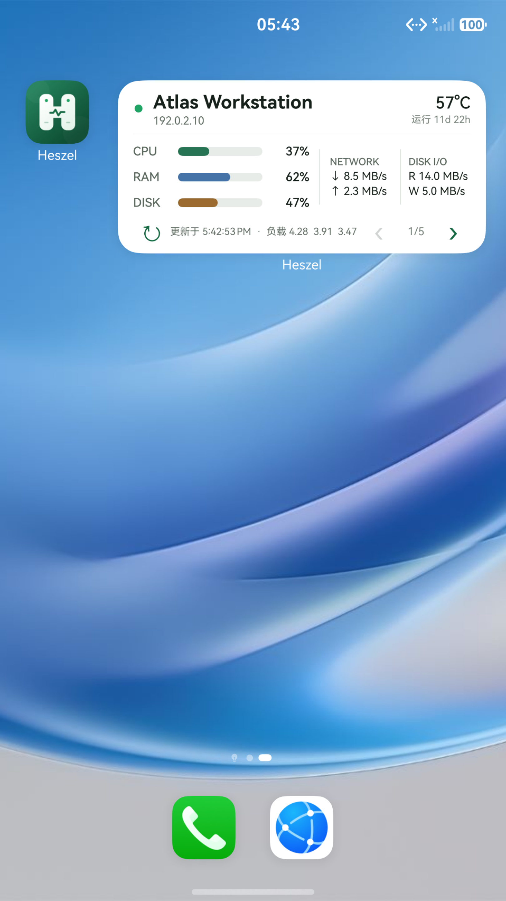

  
  <h1>Heszel</h1>
  
<strong>A lightweight server resource dashboard</strong>

  
A Beszel monitoring client built for HarmonyOS

  
<a href="README.md">简体中文</a> · English

  

## Overview

Heszel is a [Beszel](https://beszel.dev/) monitoring client designed for HarmonyOS. Connect it to your own Beszel Hub to keep an eye on all your servers from a phone, tablet, or foldable device.

Heszel focuses on the mobile monitoring experience and does not include a Beszel Hub or Agent. Beszel must be deployed first, with the systems you want to monitor added to your Hub.

## Features

- **All systems at a glance**: See online status, CPU, memory, disk usage, and temperature in one compact list, making unhealthy systems easy to spot.
- **Detailed resource metrics**: Explore CPU history and per-core usage, memory, swap, ZFS ARC, filesystems, disk I/O, load averages, temperatures, uptime, and more.
- **GPU and container monitoring**: View GPU utilization, VRAM, and power draw, plus CPU, memory, and network metrics for Docker / Podman containers.
- **Network and service health**: Inspect per-interface transfer rates and totals, systemd service health, and host sensor readings.
- **Drive health**: Review S.M.A.R.T. health, key indicators, and full attributes for SATA, NVMe, and other supported drives.
- **Live metrics**: Enable real-time updates and choose whether values continue updating while you scroll, balancing responsiveness and power use.
- **Home-screen service card**: Check CPU, memory, disk, temperature, load, network, and disk I/O without opening the app. Switch between systems or refresh directly from the card.
- **Adaptive HarmonyOS layout**: Designed for phones, tablets, and foldables, with a split layout on larger screens.
- **Personalized display**: Supports light, dark, and system color modes, Chinese and English interfaces, and adjustable CPU chart height.
- **Protected connection data**: Your password is never stored. Session and connection secrets are protected using HarmonyOS security capabilities.

> Available metrics depend on your Beszel Hub and Agent versions, server hardware, and Agent configuration.

## Connection modes

| Mode | Description |
| --- | --- |
| Direct HTTP | Sign in with your Beszel Hub address. An optional Heszel gateway access key is also supported. |
| Iroh | Scan a pairing QR code from a Heszel Iroh gateway, then reach the Hub through direct addresses or a relay. Beszel credentials and Iroh pairing data are stored separately. |

## Screenshots

<table>
  <tr>
    <td align="center"></td>
    <td align="center"></td>
    <td align="center"></td>
  </tr>
  <tr>
    <td align="center">Systems</td>
    <td align="center">Resource overview</td>
    <td align="center">GPU and containers</td>
  </tr>
</table>

<table>
  <tr>
    <td align="center"></td>
    <td align="center"></td>
  </tr>
  <tr>
    <td align="center">Drive health and S.M.A.R.T. attributes</td>
    <td align="center">Home-screen service card</td>
  </tr>
</table>

## Before you start

1. Deploy and configure a [Beszel Hub and Agent](https://beszel.dev/guide/getting-started).
2. Prepare a Beszel account that can access the systems you want to monitor.
3. Make sure your HarmonyOS device can reach the Hub, or prepare a pairing QR code from a Heszel Iroh gateway.
